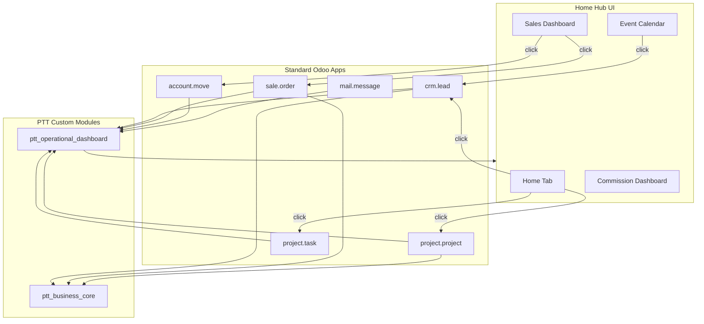

# PTT Odoo 19 - Go-Live Execution Plan

**Created:** January 6, 2026  
**Branch:** staging  
**Last Updated:** January 6, 2026

---

## Current State Summary

You have two well-structured custom modules:

| Module | Purpose | Status |
|--------|---------|--------|
| `ptt_business_core` | CRM, Sales, Project extensions | Mostly complete |
| `ptt_operational_dashboard` | Home Hub, Calendar, Sales Dashboard | UI complete, needs polish |

**What's Working:**
- Home page grid layout with all 5 sections
- Tab navigation (Home, Sales, Commission, Calendar)
- Event Calendar with stage-based coloring
- Sales Dashboard with KPIs and per-rep cards
- Deep linking to native Odoo forms
- Personal To-Dos with CRUD
- CRM 6-stage pipeline (New → Qualified → Approval → Quote Sent → Booked → Lost)
- Quote approval workflow with security group

---

## Validation Checklist (Run After Each Phase)

Per your PR Checklist, run these checks after completing each phase:

```
[ ] All XML files listed in __manifest__.py exist
[ ] Model imports in __init__.py match actual files
[ ] Security CSV: correct header, valid model references
[ ] No duplicate XML IDs across the project
[ ] View fields reference existing model fields
[ ] Search view filters use valid domain syntax
[ ] Buttons reference existing methods
[ ] Test module install: python odoo-bin -u module_name --stop-after-init
```

---

## Phase 1: Immediate Fixes

### 1.1 Missing Logo Files
**Files to add:**
```
ptt_operational_dashboard/static/description/icon.png  (128x128, app grid)
ptt_operational_dashboard/static/src/img/logo.png     (header logo)
```
Code in `home_navigation.xml` already references these.

### 1.2 Manifest Dependency Check
Verify `ptt_operational_dashboard` doesn't depend on `ptt_business_core` or vice versa causing circular issues. Currently independent - good.

### 1.3 VALIDATION CHECKPOINT
- [ ] Run module install test for both modules
- [ ] Verify no XML parse errors or missing file errors
- [ ] Confirm Home Hub loads in browser

---

## Phase 2: Security and Role-Based Access

### 2.1 Add Dashboard Security Groups
Update `ptt_security.xml`:

```xml
<!-- PTT Dashboard User (default) -->
<record id="group_ptt_dashboard_user" model="res.groups">
    <field name="name">PTT Dashboard User</field>
    <field name="implied_ids" eval="[(4, ref('base.group_user'))]"/>
</record>

<!-- PTT Dashboard Manager (CEO, COO) -->
<record id="group_ptt_dashboard_manager" model="res.groups">
    <field name="name">PTT Dashboard Manager</field>
    <field name="implied_ids" eval="[(4, ref('group_ptt_dashboard_user'))]"/>
</record>
```

### 2.2 Add "All Company" Toggle
Modify `ptt_home_data.py` methods to accept `all_company` parameter and check user groups:

```python
def _can_view_all_company(self):
    return self.env.user.has_group('ptt_operational_dashboard.group_ptt_dashboard_manager')
```

### 2.3 Update Frontend Toggle
Add conditional "All Company" switch in `home_navigation.js` visible only to managers.

### 2.4 VALIDATION CHECKPOINT
- [ ] Run module update
- [ ] Verify new groups appear in Settings > Users > Groups
- [ ] Test user with/without manager group sees correct UI
- [ ] Confirm no security CSV errors

---

## Phase 3: Commission Dashboard Completion

Current state: Placeholder link to list view. Need to build actual dashboard.

### 3.1 Commission Dashboard Component
Create `static/src/components/commission_dashboard.js/xml`:
- Monthly commission summary by rep
- Tiered GM% breakdown
- Filter by month/quarter
- Click-through to `ptt.sales.commission` records

### 3.2 Commission Calculation Fixes
Complete these in `ptt_sales_commission.py`:
- Line ~142: Implement completed event status tracking
- Line ~168: Add commission split percentage tracking
- Line ~283: Implement OSS (New Outside Client) detection

### 3.3 VALIDATION CHECKPOINT
- [ ] Run module update
- [ ] Verify Commission tab loads without JS errors
- [ ] Test commission calculations with sample data
- [ ] Confirm backend methods return expected data

---

## Phase 4: UI Polish and Branding

### 4.1 Logo Integration
Once you provide the PTT logo file:
- Black background with gold "TX PARTY TIME" text
- Save as PNG with transparency or solid black background
- Place in both paths from 1.1

### 4.2 Color Consistency
Current `home.scss` uses:
```scss
$ptt-red: #CC0000;
$ptt-dark: #2F2F2F;
```
Verify these match your brand guidelines.

### 4.3 Mobile Responsiveness Review
SCSS already has breakpoints for 1200px and 768px. Test on tablet/mobile viewports.

### 4.4 VALIDATION CHECKPOINT
- [ ] Clear browser cache, hard refresh
- [ ] Verify logo displays in header and app grid
- [ ] Test all tabs render correctly
- [ ] Check mobile view at 768px breakpoint

---

## Phase 5: Staging Deployment

### 5.1 Final Local Test
```bash
cd C:\Users\ashpt\Party-Time-Odoo
python odoo-bin -d ptt_test -u ptt_business_core,ptt_operational_dashboard --stop-after-init
```

### 5.2 Push to Staging
```bash
git add -A
git commit -m "PTT Go-Live: all phases complete"
git push origin staging
```

### 5.3 VALIDATION CHECKPOINT
- [ ] Monitor Odoo.sh build logs for errors
- [ ] Test Home Hub on staging URL
- [ ] Verify all tabs and deep links work
- [ ] Confirm security groups function correctly
- [ ] Test with different user roles

---

## Architecture Reference



---

## Execution Summary

| Phase | Focus | Validation Gate |
|-------|-------|-----------------|
| 1 | Logo files, manifest fixes | Module installs, UI loads |
| 2 | Security groups, role toggle | Groups exist, UI toggle works |
| 3 | Commission dashboard | Tab loads, calcs correct |
| 4 | UI polish, branding | Logo visible, mobile works |
| 5 | Staging deploy | Odoo.sh build passes |

---

## Key File Locations

**ptt_business_core:**
- `addons/ptt_business_core/__manifest__.py`
- `addons/ptt_business_core/models/`
- `addons/ptt_business_core/security/`

**ptt_operational_dashboard:**
- `addons/ptt_operational_dashboard/__manifest__.py`
- `addons/ptt_operational_dashboard/models/ptt_home_data.py`
- `addons/ptt_operational_dashboard/security/ptt_security.xml`
- `addons/ptt_operational_dashboard/static/src/home_controller.js`
- `addons/ptt_operational_dashboard/static/src/components/`
- `addons/ptt_operational_dashboard/static/src/home.scss`
